<div align="center">

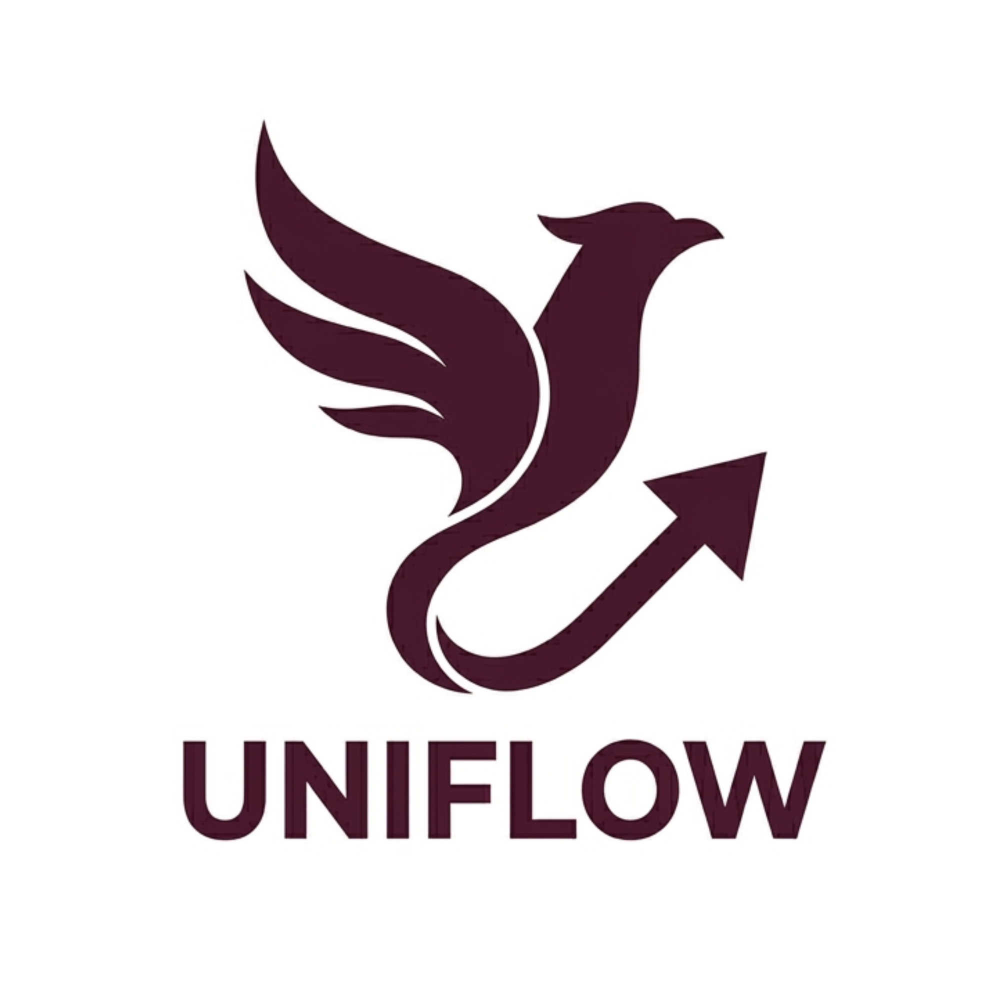

# UniFlow
### AI-Powered Smart Campus Ecosystem for University Students


*Final Year Project · 8 AI-powered tools built into one campus productivity system.*

</div>

---

## 🎯 The Problem

University students manage too many things manually and fail at all of them:

- **Lecture notes** are taken by hand, rarely reviewed, almost never organized
- **Exam preparation** is panic-driven no student knows which topics actually repeat across past papers
- **Timetables** are photographed in orientation week and never acted on classes are missed
- **Study plans** are written on paper, ignored by day three
- **Burnout** hits silently students don't notice until they stop functioning

**UniFlow** replaces all of that. One app. Student takes a photo or speaks. AI does the rest.

---

## 📸 Screenshots

<table align="center">
  <tr>
    <td align="center"><br/><sub>🏠 Home · GradePredictor</sub></td>
    <td align="center">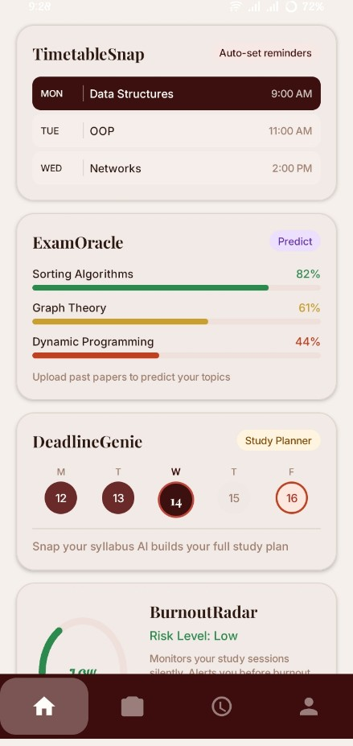<br/><sub>⚡ TimetableSnap · ExamOracle</sub></td>
    <td align="center">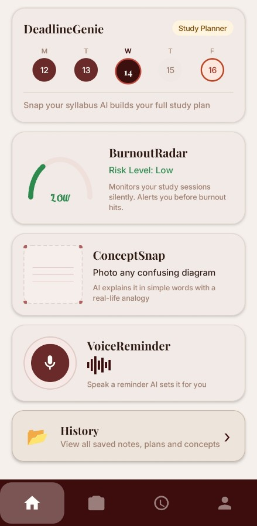<br/><sub>🛠️ ConceptSnap · VoiceReminder</sub></td>
  </tr>
  <tr>
    <td align="center">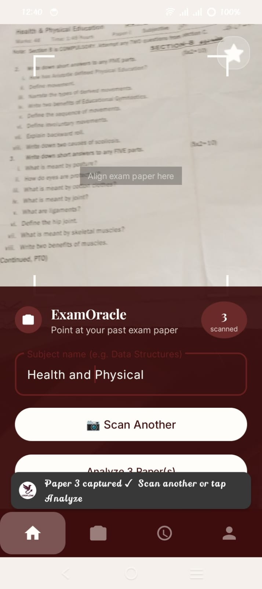<br/><sub>📄 ExamOracle · Scan Papers</sub></td>
    <td align="center">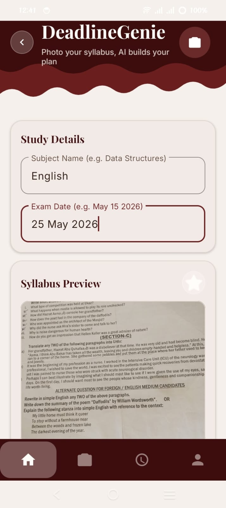<br/><sub>📅 DeadlineGenie · Syllabus Scan</sub></td>
    <td align="center">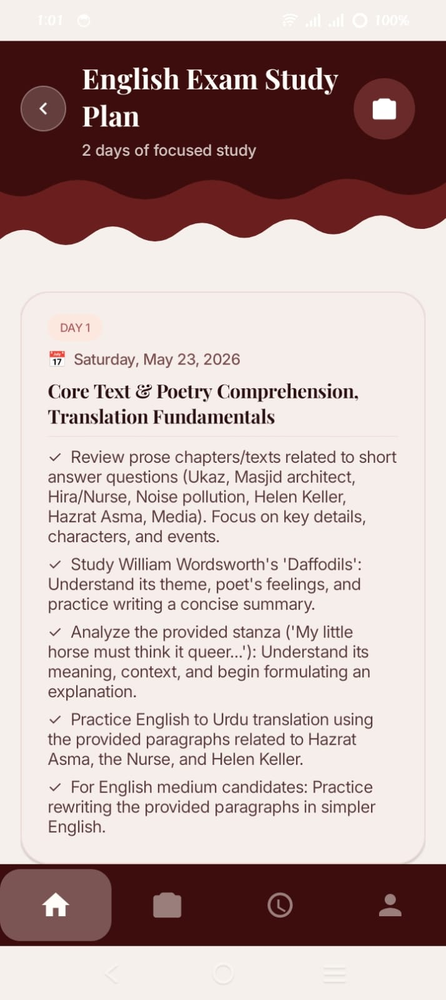<br/><sub>📋 AI Study Plan Generated</sub></td>
  </tr>
  <tr>
    <td align="center">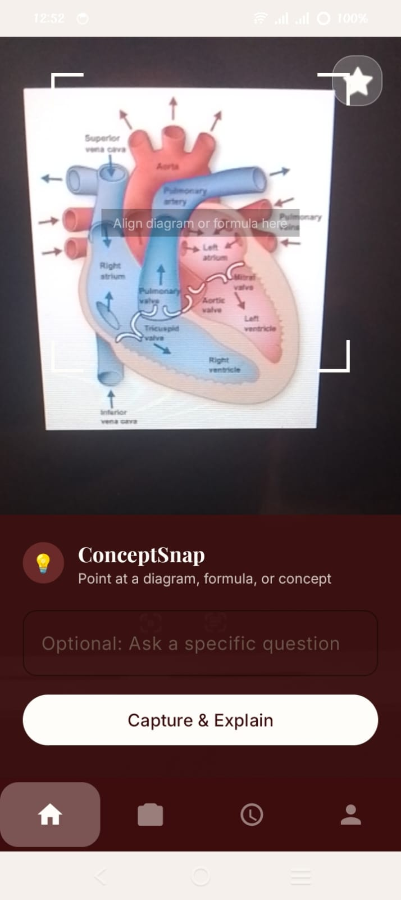<br/><sub>📷 ConceptSnap · Diagram Scan</sub></td>
    <td align="center">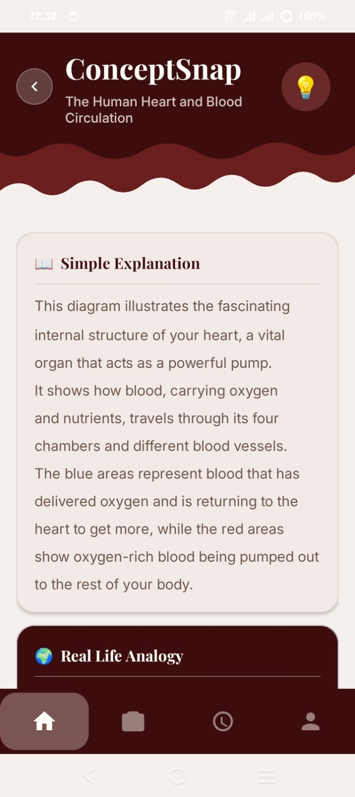<br/><sub>💡 AI Concept Explanation</sub></td>
    <td align="center">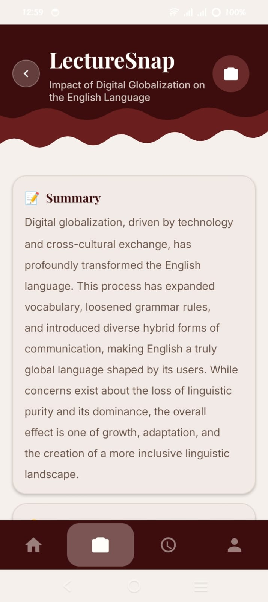<br/><sub>🧠 LectureSnap · AI Quiz</sub></td>
  </tr>
  <tr>
    <td align="center">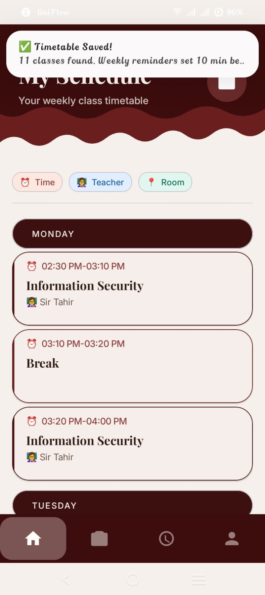<br/><sub>🗓️ My Schedule · Auto Reminders</sub></td>
    <td align="center">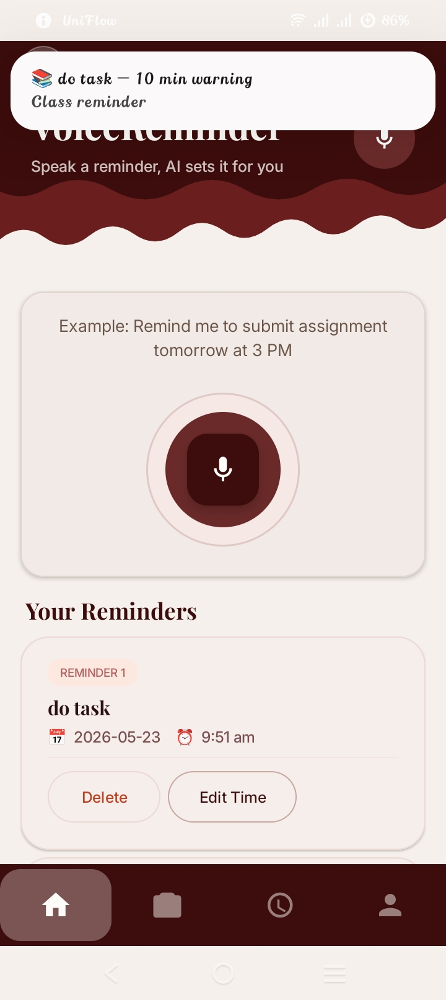<br/><sub>🎙️ VoiceReminder · Speak → Alarm</sub></td>
    <td align="center"></td>
  </tr>
</table>

---

## ⚡ The Core AI Pipeline

Every feature in UniFlow follows the same pattern built once, reused across all 8 tools:

```
Student takes photo  OR  speaks
          ↓
ML Kit OCR reads text from photo (offline, no API cost)
          ↓
Text sent to Gemini AI with a structured prompt
          ↓
Gemini returns a clean JSON response
          ↓
App parses JSON → displays result OR sets alarm automatically
```

Learn this pipeline once. It powers everything.

---

## 🛠️ The 8 AI Tools

| # | Feature | Student Action | What AI Does |
|---|---|---|---|
| 1 | **LectureSnap** | Photos lecture notes | AI generates summary, key points, flashcards & quiz |
| 2 | **TimetableSnap** | Photos class timetable | App parses schedule, sets all recurring class reminders |
| 3 | **ExamOracle** | Scans past exam papers | AI analyzes topic patterns, predicts high-probability questions |
| 4 | **DeadlineGenie** | Photos syllabus + exam date | AI builds a complete day-by-day study plan |
| 5 | **BurnoutRadar** | Nothing runs silently | Monitors study patterns, alerts before burnout hits |
| 6 | **ConceptSnap** | Photos a diagram or formula | AI explains it in simple words with a real-life analogy |
| 7 | **GradePredictor** | Enters current marks | App calculates what final exam score is needed per grade |
| 8 | **VoiceReminder** | Speaks a reminder naturally | AI extracts task + time → schedules the alarm automatically |

---

## ✨ Feature Details

### 📄 ExamOracle
Point the camera at any past exam paper. ML Kit extracts all the questions. Gemini AI analyzes topic patterns across multiple papers and returns a ranked list of high-probability topics with 3 practice questions per topic so students study what actually comes, not what they hope comes.

### 📅 DeadlineGenie
Photo the syllabus. Enter the exam date. Gemini reads every topic and deadline, then generates a structured day-by-day study calendar allocated by topic weight, spaced for review sessions. No guesswork. No procrastination.

### 💡 ConceptSnap
Point camera at any diagram, formula, or confusing concept from a textbook. The image goes directly to Gemini Vision no OCR needed. Gemini explains it in plain language with a real-life analogy that makes it stick.

### 🧠 LectureSnap
Photo handwritten or typed lecture notes. ML Kit reads the text. Gemini returns a structured response: paragraph summary, numbered key points, flashcard pairs, and ready-to-use quiz questions all saved to Room DB for offline review.

### 🗓️ TimetableSnap
Photo the semester timetable from the university notice board. Gemini parses it into a clean `{day, time, subject, teacher, room}` JSON. AlarmManager sets a recurring reminder 10 minutes before every class. Students never miss a lecture again.

### 🔥 BurnoutRadar
No screen. No input. Runs silently in the background using WorkManager. Every study session duration, quiz score, session frequency is logged to Room DB. A nightly background job sends this data to Gemini AI. If the pattern indicates burnout risk, an FCM notification fires with specific rest advice.

### 📊 GradePredictor
A straightforward calculator with a clean chart UI. Student enters quiz marks, assignment marks, and midterm score. The app computes what final exam percentage is needed to achieve each grade A, B, C and shows it as a visual bar chart.

### 🎙️ VoiceReminder
Tap the mic, speak naturally: *"Remind me to submit my assignment tomorrow at 3 PM."* SpeechRecognizer captures it. Gemini extracts `{task, date, time}` as JSON. AlarmManager schedules the exact notification. No typing required.

---

## 🏗️ Architecture

**Pattern:** MVVM (Model–View–ViewModel)  
**Storage:** Room Database (offline-first) + Firebase Firestore (cloud sync)  
**Background work:** WorkManager for BurnoutRadar analysis

```
app/
└── java/com/uniflow/
    │
    ├── MainActivity.kt
    │
    ├── data/
    │   ├── local/
    │   │   ├── AppDatabase.kt              # Room DB central database
    │   │   ├── entity/
    │   │   │   ├── NoteEntity.kt           # Lecture notes
    │   │   │   ├── TimetableEntity.kt      # Class schedule
    │   │   │   ├── StudyPlanEntity.kt      # DeadlineGenie output
    │   │   │   ├── ExamTopicEntity.kt      # ExamOracle predictions
    │   │   │   ├── GradeEntity.kt          # GradePredictor entries
    │   │   │   ├── ReminderEntity.kt       # VoiceReminder records
    │   │   │   └── StudyLogEntity.kt       # BurnoutRadar session data
    │   │   └── dao/
    │   │       ├── NoteDao.kt
    │   │       ├── TimetableDao.kt
    │   │       ├── StudyPlanDao.kt
    │   │       ├── ExamTopicDao.kt
    │   │       ├── GradeDao.kt
    │   │       ├── ReminderDao.kt
    │   │       └── StudyLogDao.kt
    │   │
    │   ├── remote/
    │   │   ├── GeminiClient.kt             # All Gemini API calls (text + vision)
    │   │   └── FirebaseClient.kt           # Auth + Firestore sync
    │   │
    │   ├── model/                          # JSON response shapes from Gemini
    │   │   ├── NoteResult.kt
    │   │   ├── TimetableResult.kt
    │   │   ├── StudyPlanResult.kt
    │   │   ├── ExamOracleResult.kt
    │   │   ├── ConceptResult.kt
    │   │   ├── GradeResult.kt
    │   │   ├── ReminderResult.kt
    │   │   └── BurnoutResult.kt
    │   │
    │   └── repository/                     # Single source of truth per feature
    │       ├── LectureRepository.kt
    │       ├── TimetableRepository.kt
    │       ├── StudyPlanRepository.kt
    │       ├── ExamOracleRepository.kt
    │       ├── BurnoutRepository.kt
    │       ├── ConceptRepository.kt
    │       ├── GradeRepository.kt
    │       └── ReminderRepository.kt
    │
    ├── ui/                                 # Fragments + ViewModels per feature
    │   ├── home/
    │   ├── lecturesnap/
    │   ├── timetablesnap/
    │   ├── examoracle/
    │   ├── deadlinegenie/
    │   ├── burnoutradar/
    │   ├── conceptsnap/
    │   ├── gradepredictor/
    │   └── voicereminder/
    │
    ├── worker/
    │   └── BurnoutWorker.kt                # Nightly WorkManager job
    │
    └── utils/
        ├── CameraHelper.kt                 # CameraX setup & capture
        ├── OcrHelper.kt                    # ML Kit text extraction
        ├── AlarmHelper.kt                  # AlarmManager scheduling
        ├── GeminiPrompts.kt                # All prompts in one file
        ├── GradeCalculator.kt              # Grade math logic
        ├── SpeechHelper.kt                 # SpeechRecognizer wrapper
        ├── Constants.kt
        └── Extensions.kt
```

---

## ⚙️ Key Engineering Decisions

### 1. Single AI Pipeline, Eight Features
Rather than building eight separate AI integrations, all features share the same `GeminiClient.kt` and `OcrHelper.kt`. The only thing that changes per feature is the **prompt** in `GeminiPrompts.kt`. Adding a new AI feature is adding one prompt and one repository not rebuilding the pipeline.

### 2. ML Kit OCR Before Gemini (Cost Control)
Text-based features (LectureSnap, TimetableSnap, ExamOracle, DeadlineGenie) use ML Kit to extract text locally **free, offline, fast** before sending anything to Gemini. Only ConceptSnap sends the image directly to Gemini Vision because it needs spatial understanding of diagrams. This design minimizes API token usage significantly.

### 3. Gemini Returns Structured JSON Always
Every Gemini prompt in `GeminiPrompts.kt` explicitly instructs the model to return structured JSON. Responses are parsed with Gson into typed model classes. No regex. No string manipulation. Clean deserialization at every feature.

### 4. Room DB as the Offline Layer
Seven Room entities with dedicated DAOs mean every feature's output is immediately persisted locally. If the network drops after a scan, the result is still there. Students can review past ExamOracle predictions, old study plans, and saved notes without any connectivity.

### 5. WorkManager for BurnoutRadar
BurnoutRadar cannot rely on the student opening the app it must run in the background. WorkManager handles this correctly across Android versions, survives process death, and integrates with the system's battery optimization without being killed. The nightly job checks `StudyLogEntity` and only fires an FCM alert when Gemini confirms burnout risk.

### 6. AlarmManager for Class Reminders
TimetableSnap uses `AlarmManager` with `setExact()` to schedule recurring class reminders not `WorkManager`, which has minimum 15-minute intervals. Class schedules require minute-level precision. The schedule is rebuilt from `TimetableEntity` on device restart via a `BroadcastReceiver`.

---

## 🛠️ Tech Stack

| Layer | Technology | Reason |
|---|---|---|
| Language | Kotlin | Modern Android standard |
| AI Engine | Gemini API (text + vision) | Handles both OCR output and raw images |
| OCR | ML Kit Text Recognition | Free, works fully offline |
| Camera | CameraX | Best-practice Android camera API |
| Voice | Android SpeechRecognizer | Built-in, no third-party dependency |
| Alarms | AlarmManager | Minute-level precision for class reminders |
| Background Jobs | WorkManager | Battery-safe background analysis |
| Local Storage | Room Database (7 entities, 7 DAOs) | Offline-first data persistence |
| Cloud | Firebase Auth + Firestore + FCM | Auth, sync, burnout push alerts |
| Architecture | MVVM + Repository Pattern | Clean separation, testable code |
| UI | Material Design 3 | Google's official Android design system |
| JSON Parsing | Gson | Deserialize all Gemini responses |
| Navigation | Navigation Component | Single-activity, fragment-based nav |

---

## 🚀 Getting Started

```bash
git clone https://github.com/AreejFatima33/uniflow.git
cd uniflow
```

Open in **Android Studio Hedgehog** or later.

Add these to your project before running:

```
google-services.json        ← from Firebase Console
```

In `utils/Constants.kt`, set your Gemini API key:
```kotlin
const val GEMINI_API_KEY = "your_api_key_here"
```

Get your free Gemini API key at [aistudio.google.com](https://aistudio.google.com).

```bash
./gradlew assembleDebug
```

**Minimum SDK:** Android 8.0 (API 26)  
**Target SDK:** Android 14 (API 34)

---

## 📦 Key Dependencies

```gradle
// Gemini AI
implementation 'com.google.ai.client.generativeai:generativeai:0.7.0'

// ML Kit OCR (offline)
implementation 'com.google.mlkit:text-recognition:16.0.0'

// CameraX
implementation 'androidx.camera:camera-camera2:1.3.0'
implementation 'androidx.camera:camera-lifecycle:1.3.0'
implementation 'androidx.camera:camera-view:1.3.0'

// Room Database
implementation 'androidx.room:room-runtime:2.6.0'
kapt 'androidx.room:room-compiler:2.6.0'
implementation 'androidx.room:room-ktx:2.6.0'

// Firebase
implementation 'com.google.firebase:firebase-firestore-ktx:24.0.0'
implementation 'com.google.firebase:firebase-auth-ktx:22.0.0'
implementation 'com.google.firebase:firebase-messaging-ktx:23.0.0'

// WorkManager
implementation 'androidx.work:work-runtime-ktx:2.9.0'

// ViewModel + LiveData
implementation 'androidx.lifecycle:lifecycle-viewmodel-ktx:2.6.0'
implementation 'androidx.lifecycle:lifecycle-livedata-ktx:2.6.0'

// Navigation Component
implementation 'androidx.navigation:navigation-fragment-ktx:2.7.0'
implementation 'androidx.navigation:navigation-ui-ktx:2.7.0'

// Gson (JSON parsing)
implementation 'com.google.code.gson:gson:2.10.1'

// Material Design 3
implementation 'com.google.android.material:material:1.11.0'
```

---

## 🗺️ Development Timeline

| Week | Focus | Key Deliverables |
|---|---|---|
| **1** | Setup | Project scaffold, MVVM structure, Firebase, Gemini API key, nav graph |
| **2** | Core Pipeline | CameraX → ML Kit OCR → Gemini → Room DB (tested end-to-end) |
| **3** | LectureSnap + TimetableSnap | Note summarization, schedule parsing, AlarmManager reminders |
| **4** | ExamOracle + DeadlineGenie | Topic prediction, day-by-day study plan generation |
| **5** | BurnoutRadar + ConceptSnap | WorkManager background job, Gemini Vision for diagrams |
| **6** | GradePredictor + VoiceReminder | Grade calculator, SpeechRecognizer → Gemini → AlarmManager |
| **7** | Testing + Bug Fixes | Real data testing, offline mode, Android 8–14 compatibility |
| **8** | Polish + Submission | UI consistency, APK build, presentation prep |

---

## 👩‍💻 Developer

**Areej Fatima** · Flutter & Android Developer 

[](https://areejfatima33.github.io/areej-portfolio/)
[](https://www.linkedin.com/in/areej-dev01/)
[](https://github.com/AreejFatima33)
[](https://play.google.com/store/apps/developer?id=Areexa+Studios)

---

<div align="center">
  <sub>Built as Final Year Project · Native Android · Kotlin · Gemini AI</sub>
</div>
